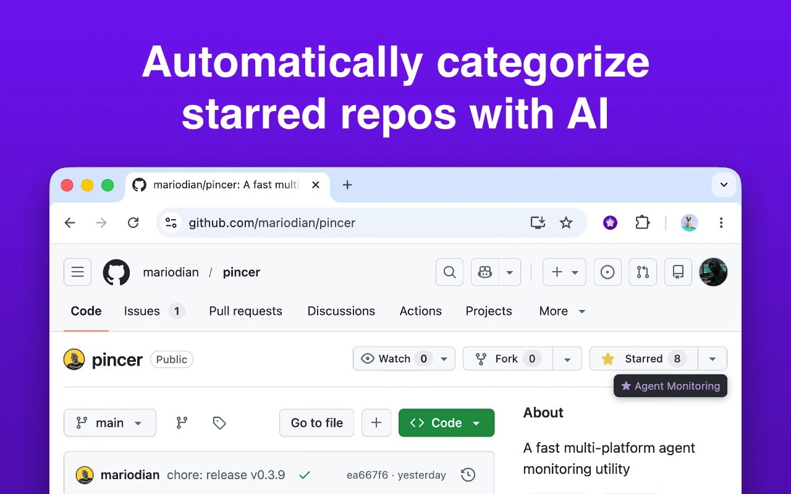
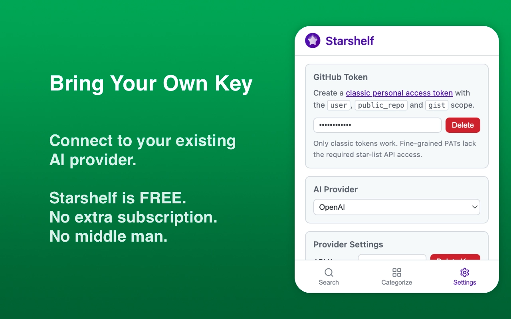
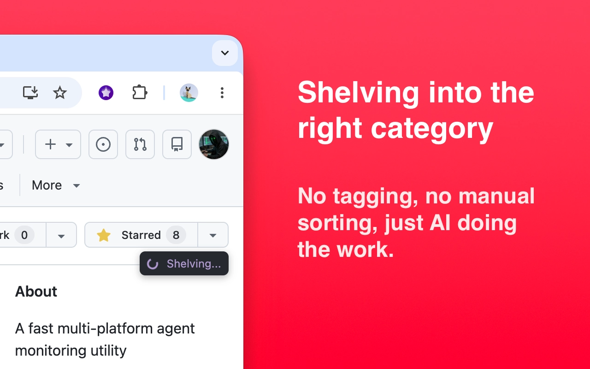
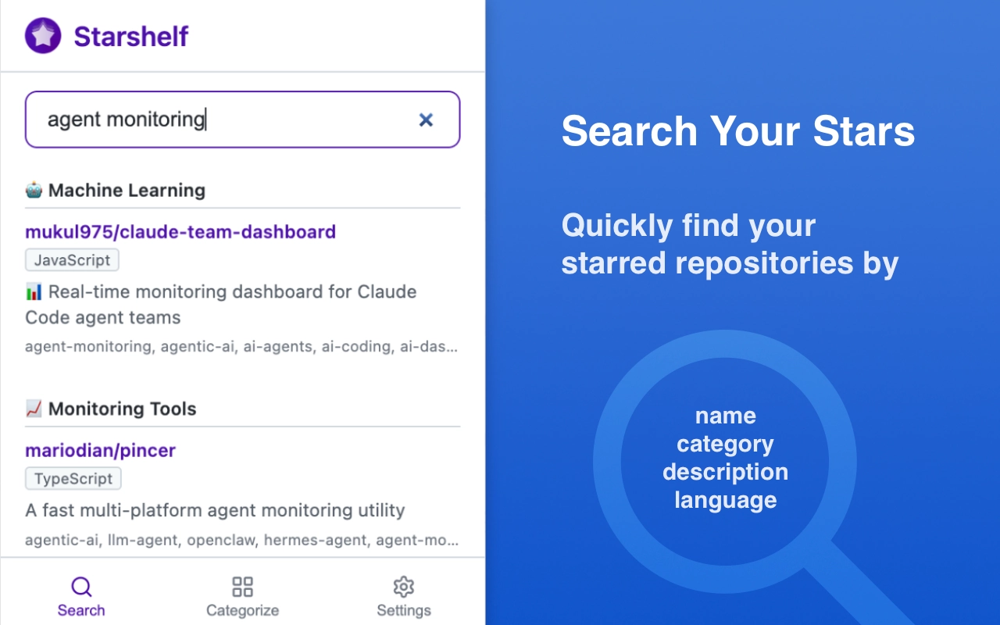

<div align="center">

<h1>Starshelf</h1>

Auto-categorize GitHub starred repos with AI.<br />Pick a provider, set your key, and every star gets shelved with a category — no manual sorting required.

[Changelog](./CHANGELOG.md) · [Report Bug](https://github.com/mariodian/starshelf/issues/new?template=bug-report.md) · [Request Feature](https://github.com/mariodian/starshelf/issues/new?template=feature-request.md)

[](https://github.com/mariodian/starshelf/actions)
[](https://github.com/mariodian/starshelf/releases)
[](./LICENSE)
[](https://chromewebstore.google.com/detail/starshelf/cofjbnkmfcpmpdlonjookehnpncaalpj)
[](https://addons.mozilla.org/en-US/firefox/addon/starshelf/)

</div>

## ⚡ Quick Start

```bash
git clone https://github.com/mariodian/starshelf.git
cd starshelf
bun install && bun run dev
```

Load the `dist/` folder as an unpacked extension in `chrome://extensions`.

## 📋 Table of Contents

- ⚡ [Quick Start](#-quick-start)
- 🤔 [Why Starshelf?](#-why-starshelf)
- ✨ [Features](#-features)
- 📥 [Installation](#-installation)
- 🚀 [Usage](#-usage)
- 🔑 [Permissions](#-permissions)
- ⚠️ [Known Limitations](#️-known-limitations)
- 🔧 [Troubleshooting](#-troubleshooting)
- 💬 [Contributing](#-contributing)
- 📜 [License](#-license)
- 📌 [Credits](#-credits)

## 🤔 Why Starshelf?

GitHub stars pile up fast. Before you know it you have hundreds of repos and no way to find that one library you starred six months ago. Starshelf watches your stars and uses AI to label every repo the moment you star it — so you can browse by category instead of digging through a flat list.

<table border="0" align="center" cellspacing="0" cellpadding="10">
  <tr>
    <td colspan="4" align="center" valign="middle">
      <a href="media/screenshots/screen-1.webp"></a>
    </td>
  </tr>
  <tr>
    <td width="25%" align="center" valign="middle">
      <a href="media/screenshots/screen-2.webp"></a>
    </td>
    <td width="25%" align="center" valign="middle">
      <a href="media/screenshots/screen-3.webp"></a>
    </td>
    <td width="25%" align="center" valign="middle">
      <a href="media/screenshots/screen-4.webp"></a>
    </td>
    <td width="25%" align="center" valign="middle">
      <a href="media/screenshots/screen-5.webp"></a>
    </td>
  </tr>
</table>

## ✨ Features

- **Star-and-forget**: detects star clicks on GitHub and categorizes repos automatically
- **Batch categorize**: classify all starred repos at once with session-backed progress tracking
- **Search your stars**: filter and find starred repositories by name, description, or language
- **Multi-provider AI**: Anthropic, OpenAI, or OpenCode — bring your own API key
- **Instant overlay**: category label appears on the page right after starring
- **Regenerate categories**: re-categorize already-assigned repos without clearing existing assignments
- **Emoji & formatting**: toggle emoji prefixes, category-prefix labels, and auto-detect existing list naming conventions
- **Lightweight**: no bundler bloat, no framework — vanilla TypeScript + WXT

## 📥 Installation

[](https://chromewebstore.google.com/detail/starshelf/cofjbnkmfcpmpdlonjookehnpncaalpj)
[](https://addons.mozilla.org/en-US/firefox/addon/starshelf/)

### From source

```bash
git clone https://github.com/mariodian/starshelf.git
cd starshelf
bun install
```

### ✅ Requirements

- [Bun](https://bun.sh) v1.0+
- Chromium-based browser (Chrome, Edge, Brave, Arc, etc.) or Firefox

## 🚀 Usage

```bash
# Dev with hot reload
bun run dev

# Production build
bun run build

# Package for distribution
bun run zip
```

Load the `dist/` folder as an unpacked extension in `chrome://extensions`.

For a full list of commands (Firefox builds, testing, formatting), see [CONTRIBUTING.md](./CONTRIBUTING.md).

## 🔑 Permissions

| Permission                                                           | Why                                       |
| -------------------------------------------------------------------- | ----------------------------------------- |
| `storage`                                                            | Persist settings and categorizations      |
| `https://github.com/*`                                               | Content script injection + repo detection |
| `https://api.github.com/*`                                           | GitHub API: lists, starring, repo lookups |
| `https://api.anthropic.com/*` / `api.openai.com/*` / `opencode.ai/*` | AI provider API calls                     |

## ⚠️ Known Limitations

- **Chromium-first**: the extension is primarily developed and tested on Chromium-based browsers (Chrome, Edge, Brave, Arc); Firefox support is available but less tested
- **API key required**: Starshelf does not bundle AI access — you must bring your own API key from a supported provider
- **GitHub-only**: only `github.com` repos are supported; GitHub Enterprise and self-hosted instances are not detected
- **Popup configuration**: initial setup requires opening the extension popup to enter credentials before categorization works

## 🔧 Troubleshooting

### Extension doesn't appear after `bun run dev`

Make sure developer mode is enabled in `chrome://extensions` and the `dist/` folder is loaded as unpacked. If Chrome reports an error, check the terminal output for build failures.

### Stars aren't being categorized

Open the extension popup and verify your API key is set and the provider is selected. Check the background service worker console in `chrome://extensions` → "Inspect views: service worker" for error logs.

### Overlay doesn't show on GitHub

Confirm the extension has permission to run on `https://github.com/*`. If you installed the extension after opening GitHub, refresh the page.

## ❤️ Like This Project?

If Starshelf is useful to you, consider leaving a star on GitHub and sharing it with others.

<a href="https://twitter.com/intent/tweet?url=https%3A%2F%2Fgithub.com%2Fmariodian%2Fstarshelf&text=Auto-categorize%20GitHub%20stars%20with%20AI.%20Star%20a%20repo%2C%20Starshelf%20labels%20it.%0A%0AGitHub%3A&via=mariodian" target="_blank" rel="noopener noreferrer" style="display: inline-flex; align-items: center; justify-content: center; gap: 8px; padding: 10px 20px; color: #fff; background-color: #000000; text-decoration: none; border-radius: 5px; font-family: sans-serif; font-weight: bold; font-size: 1rem;">
<svg width="24" height="24" fill="#fff" viewBox="0 0 24 24"><path d="M18.244 2.25h3.308l-7.227 8.26 8.502 11.24H16.17l-5.214-6.817L4.99 21.75H1.68l7.73-8.835L1.254 2.25H8.08l4.713 6.231zm-1.161 17.52h1.833L7.084 4.126H5.117z"/></svg>
<span>Share on X (Twitter)</span>
</a>

## 💬 Contributing

See [CONTRIBUTING.md](./CONTRIBUTING.md) for development guidelines.

## 📜 License

MIT. See [LICENSE](LICENSE).

## 📌 Credits

Feel free to remove this section. Otherwise, credit is appreciated.

[Starshelf on GitHub](https://github.com/mariodian/starshelf) · [Mario Dian on X](https://x.com/mariodian)
